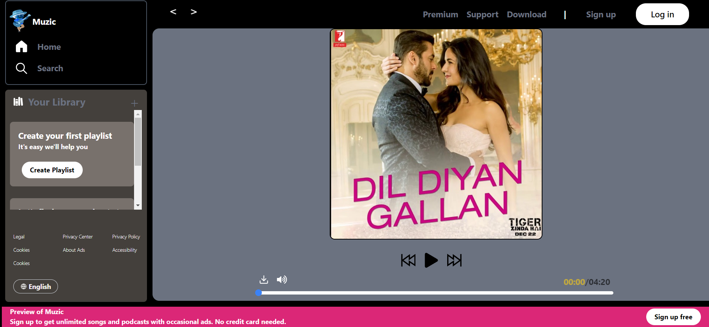
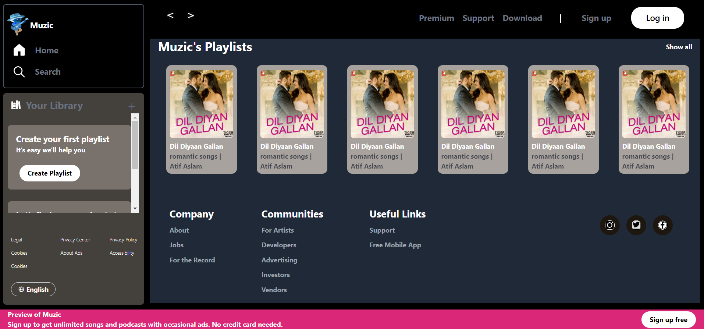

# Muzic - Your Ultimate Music Experience

## Overview

Muzic is a feature-rich music application developed to provide users with a seamless and enjoyable music listening experience. This project is aimed at [briefly describe the goal of your app].

## Features

1. **Intuitive User Interface:** Muzic features a clean and user-friendly interface designed to enhance navigation and user experience.

2. **Extensive Music Library:** Explore a vast collection of music covering various genres, ensuring there's something for everyone.

3. **Smart Recommendations:** Our intelligent recommendation system suggests tracks based on user preferences and listening history, making your music discovery personalized.

## Getting Started

These instructions will help you get a copy of the project up and running on your local machine for development and testing purposes. See deployment for notes on how to deploy the project on a live system.

### Prerequisites

[List any prerequisites or dependencies needed for the project]

```bash

npm install
```
### Shots



